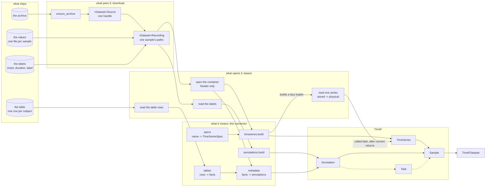
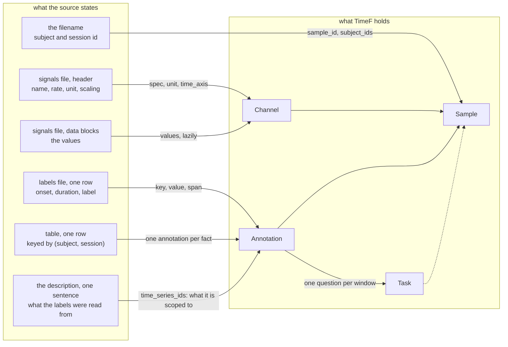

# Heads, surveys, and the map

Reference for phase 1 of the `add-dataset-connector` skill.

**How to read this.** The method is general. Examples are marked *Sleep-EDF:* and come from
`physionet/sleep_edfx`. A number marked *(measured)* was counted over that one release. Your dataset
will have different files, different shapes and different numbers, and the same three questions.

This phase answers those three questions, and each has its own tool:

| question | tool | cost |
| --- | --- | --- |
| What shape is one file of this kind? | a `head()` | one small read per file type |
| What is odd about this release? | a survey | one walk, one table |
| How do the files reach TimeF? | the map | no reads at all |

## Contents

- [The budget](#the-budget)
- [Give every raw file type a `head()`](#give-every-raw-file-type-a-head)
- [How to open each kind of file](#how-to-open-each-kind-of-file)
- [Survey the release](#survey-the-release)
- [Name the set of files that one sample needs](#name-the-set-of-files-that-one-sample-needs)
- [Choose the download shape](#choose-the-download-shape)
- [Draw the map](#draw-the-map)
- [Draw the sample model](#draw-the-sample-model)

## The budget

**The context cost of phase 1 does not grow with the size of the release.** A release of 200
recordings and one of 200 000 both give three heads and one survey table. Hold that invariant. It is
what keeps this phase possible on a dataset you cannot download twice.

Three rules follow from it:

- One head for each file **type**, never one per file.
- A head is bounded by construction, not truncated after the read. A head of an 8 GB release reads
  one block of the container, not one whole file.
- The survey walks every file, but only its table enters the conversation. Run the walk in a
  subagent and take back the table alone.

**A block is the smallest unit the container lets you decode, and it is not the same size in every
format.** Read the size before you promise a bound:

| format | one block | how large |
| --- | --- | --- |
| EDF | one data record | the header states the duration and the values per record |
| WFDB | the header alone, or the first samples of one lead | a header is a few hundred bytes |
| parquet | one row group | as large as the writer chose, and often far larger than a reader expects |
| xls / xlsx | the whole sheet, then the first rows | the reader gives every row, so the head slices |

A parquet row group is the case that surprises people. It is bounded, and it is not small. Say in
the plan which unit the head read, so a reader knows what the bound was.

## Give every raw file type a `head()`

A connector reads more than one kind of file, and the kinds are not alike. Each kind has its own
shape, and few of them open in an editor.

A `head()` opens one file, reads a small part of it, and gives that part back as text a person can
read. It writes nothing and it changes nothing.

**Open what phase 0 wrote before you open a file.** Phase 0 put what the release says about itself
into section 0 of `docs/notes/connectors/<org>/<name>/plan.md`. Have these three open, where they
exist:

- **`source_url`** — the dataset's own page, as the card states it.
- **What the description states** — the sentences phase 0 quoted, each with the URL it came from.
- **What the metadata files claim** — the table of what a `dataset_info.json`, a manifest, a data
  dictionary or a `state.json` declares. Phase 1 fills in its last column, `what the files show`.

A source page can be absent or say very little, and phase 1 still runs. The thinner it is, the more
of the role rests on the head, and the plan says so.

**A head is what establishes what a file holds, so do not start from a name for it.** Work in this
order. The container is free to see. The role is a guess until a head tests it.

1. **Group the files by container first.** The extension, the path and the magic bytes give the
   grouping. None of them costs a read of the data. A container says how to open a file. It says
   nothing about what the file means.
2. **Take the role of each group from phase 0, as a hypothesis.** The guess comes from those three
   sources. Write each guess down with the sentence it came from, so a reader sees what it rests on.
3. **Head the file to test the guess.** A head confirms the hypothesis or refutes it. One release
   declares nine columns and ships seven *(measured)*. So a release can be wrong about its own
   schema. A release that is wrong about a schema can be wrong about what a file holds. Where
   the head disagrees with phase 0, the head wins, and the disagreement goes in the plan.
   A refuted guess sends you back to the source page and the description, not into more bytes.
4. **Once the head confirms the kind, write one function per kind of file. Name it for the kind and
   not for the file extension.** The kinds are the ones your release ships. Do not force a release
   into a standard set of names. A columnar release has no signals file and no label file, and its
   kinds are `head_shard`, `head_declared_schema` and `head_windows`.
   - *Sleep-EDF:* three kinds — a container of signals, a container of annotations, and a
     spreadsheet of subjects. *ECG-QA:* WFDB records and three CSV files.
5. **Head a file that nothing names by its container alone, and let the output name it.** An
   undocumented sidecar or an unfamiliar extension carries no hypothesis, and it is the file a head
   is most useful for. Open it the way its container allows. Print what comes out. Take the name
   from what it printed. Where the print still names nothing, read the source page again. Do not
   read further into the file. Call it by its container until then.

**The signature follows the container, and only the name follows the role.** A binary container
takes a count of blocks, and a tabular one takes a count of rows. The grouping in step 1 settles
that. The name waits for the head.

So you write a head twice, and only the name changes. Write it against the container, because that
is all you know:

```python
def head_edf(path: Path, blocks: int = 1) -> str: ...
def head_xls(path: Path, rows: int = 5) -> str: ...
```

Then run it and read what it prints. Rename each one for the anatomy the print revealed. The anatomy
is how the file is built, not what TimeF will make of it:

```python
def head_sampled_channels(path: Path, blocks: int = 1) -> str: ...
def head_labeled_intervals(path: Path, rows: int = 5) -> str: ...
def head_keyed_table(path: Path, rows: int = 5) -> str: ...
```

The signatures are the same on both sides. That is the whole point: the container fixed them before
you read anything, and the head only supplied the name.

**Name a file for its anatomy, never for the TimeF object it feeds.** A file has one anatomy and it
can feed several objects. So a name like `head_annotations` states a mapping the head cannot see and
the release often contradicts. `head_labeled_intervals` says what the file holds and commits to
nothing about where those intervals end up.

- *Sleep-EDF:* the hypnogram is one file of labeled intervals, and it feeds both. `annotations.py`
  turns each entry into an `Annotation`, and `tasks.py:107` walks the same entries in steps of 30 s
  to build one `ClassificationTask` per epoch.
- *ECG-QA:* the connector reads the chain-of-thought CSVs twice, at `connector.py:216` for the
  annotations that `register_annotations` stores, and again at `:297` for the task stream.

**Two anatomies can share one container, and that is the case the head exists for.** A grouping by
container cannot separate them, so no amount of care in step 1 reaches the answer.

- *Sleep-EDF:* the sampled channels and the scored intervals are both EDF. A grouping by container
  gives two groups where the release has three anatomies. You must open one file to see which EDF is
  which.

Each gives a string, so a caller can print it, write it to a file, or put it in a test. Each reads
only the part it prints.

### Where a head lives

**A head does not ship with the connector.** Write it at
`docs/notes/connectors/<org>/<name>/heads.py`, beside `plan.md` and the survey. A reader already
goes there to see how you read the raw release. A head is a tool a person runs during discovery.
It answers a question phase 1 asks one time. If you put it in the connector package, no module
imports it and no test covers it. No gate keeps it true against a changed release.

**Give the file a `__main__`, so the user can run it themselves.** The user wants to open the data,
and a command they run beats output somebody else pasted:

```python
if __name__ == "__main__":
    import sys

    print(head_sampled_channels(Path(sys.argv[1])))
```

```bash
uv run python docs/notes/connectors/<org>/<name>/heads.py <path to one file>
```

Record that command in the plan, beside the output it produced. Then every block of evidence is one
the user can run again.

### What each kind prints

- **sampled channels** — the header fields, then one data record: the channel names, their rates,
  their units, and the first values of each.
- **labeled intervals** — the first rows as `onset, duration, label`, with the count of rows.
- **a keyed table** — the header row and the first data rows of the sheet, and the column that keys
  it.
- **a cell that holds an array** — the dtype, the shape, and the first few values. Never the array.
  One parquet cell can hold 4000 floats, so five rows printed as text are 20 000 numbers.
- **a sidecar that describes the release** — a `dataset_info.json`, a manifest, a data dictionary.
  Print its keys and every claim it makes about the data. Those claims are what the other heads then
  check.

**Print the dtype of every column. Put it in the plan beside the dtype the spec will declare.**
`TimeSeriesSpec.dtype` defaults to `float32`. A source that stores `double` fails when the writer
first calls a loader. That is long after `convert` returned. A test written over synthetic data of
the wrong dtype passes.

**A head prints an absent column as absent. It never raises on one.** The absence is the finding:
"this file lacks a column the others have" is exactly what phase 1 is for, and an exception throws it
away. Write the head so it reports what it did not find.

**Where the release states its own schema, print the declaration and the file, and compare them.**
A declaration can be wrong. One release declares nine columns and ships seven, and the two it does
not ship are the two a sample id can come from *(measured)*. If you believe the declaration, you
design an identity the data cannot supply. The survey then checks every file against the
declaration, not only the first one.

## How to open each kind of file

This repo ships a reader for three of these: EDF, WFDB and xls. Parquet and CSV need only a
library the environment already has. Use the calls in the table that follows. Do not invent one.
Read the bounded call in the third column, because several of the obvious calls read a whole file.

| format | library or module | the bounded call | what to print |
| --- | --- | --- | --- |
| EDF | `bases/edf/reader.py`, over `edfio` | `reader.open_edf(path)` for the header, then `reader.read_record(file, 0)` for one data record. Not `reader.read_channel(file, index)`, which reads the whole channel | the channel names, rates, units, and the first values of each |
| WFDB | `bases/physionet.py`, over `wfdb` | `BasePhysioNetConnector._read_header(record_base)`, a `@staticmethod`, so a head outside the class can call it | `fs`, `sig_len`, `sig_name`; no signal decode |
| xls / xlsx | `bases/excel.py`, over `xlrd` | `excel.read_table_rows(path)`, then slice `[:6]` | the header row and the first data rows |
| parquet | `pyarrow.parquet` | `pq.ParquetFile(path).schema_arrow` for the schema, `.metadata` for the row counts, `.read_row_group(0)` for values. `ListArray.value_lengths()` measures a list column without decoding its values | the column names with their dtypes, the row-group sizes, and the first values of each column |
| CSV | the stdlib `csv` module | `itertools.islice(csv.reader(handle), 6)` | the header row and the first data rows |

**No format outside that table has a reader in this repo.** If the table does not name the format of
a release, you write the opener as well as the head, and the plan says so.

## Survey the release

A survey is a count, and its purpose is to find where two samples differ. **It is evidence, not
truth**: it answers the question you asked and nothing else. So state every count with how you
counted it. Let the build in phase 5 settle it.

**You cannot find the odd values by reading.** An anomaly worth knowing is almost always a fact
about the *set*. One file in a hundred differs. A value varies per file where you assumed a
constant. A table disagrees with the headers for a handful of rows. A careful read of one file finds
none of them.

The signature of a shape is:

- the series names, with their units and their rates,
- the labels the annotations use,
- the shape of the table row the sample joins to.

**Those three, and not others, because each one feeds a part of the sample model.** You run a survey
for what it decides later. So count them, and know where each one goes:

| the signature item | what it feeds |
| --- | --- |
| a series name | the key of the spec map, and the series name the source keeps |
| its unit | the spec, which says what kind of thing the series measures |
| its rate | the time axis, read per file rather than fixed |
| the labels | the annotation keys and values, and whether the set of labels is closed |
| the table row | the per-subject facts that become annotations, and the key that joins them |

Count them here. Design the model in section 2 of the plan, not in the survey.

Run the signature over every set of files and count the groups. Write the result as one column per
group, one row per property that differs:

| | shape A | shape B |
| --- | --- | --- |
| samples | | |
| series per sample | | |
| the rate of each | | |
| names that differ for the same kind of thing | | |
| the table row it joins to | | |
| encodings that differ between groups | | |

Then, beside it, the properties that vary *within* a group and are thus not shape at all.

- *Sleep-EDF:* the survey gives two groups, `sleep-cassette` (153 recordings, 7 channels, 30 s
  records with one file at 60 s) and `sleep-telemetry` (44 recordings, 5 channels, 10 s records)
  *(measured)*. The same channel name `EMG submental` runs at 1 Hz in one and 100 Hz in the other.
  Each group names the marker channel differently. The two sheets even encode sex in opposite
  directions, `F=1, M=2` against `M=1, F=2`. One group states 117 distinct physical ranges across
  its 153 files, the other one range for all 44.

**A survey that finds two shapes does not mean two modules.** It says where the code must take a
value instead of a constant, and that is all it says. Every row of such a table is one of two
things. It is a value the file states in its own header, or a value the description states as data.
Neither is a branch on which part of the release you are in.

**Leave out of the signature what varies file by file.** Per-file calibration is not shape. If the
survey gives one group per file, the signature is too strict. If it gives one group for the whole
release, the signature is too loose, and you must still find the property that separates them.

**Then count the samples**, whether or not the count is a `len()`. Prefer a count the release states
about itself — an index file, a manifest, a row count — over one you derive. Say which you used.
If you cannot count the samples before you convert, you do not yet know what a sample is.

**A count settles how many. It does not settle what is in them.** The rules that follow ask the
second question. A release can pass every one of those counts and still ship content nobody can use.

**Survey a free-text column for its shape, not only for its presence.** A count of nulls, empty
strings and duplicates says the text is there. It does not say the text is finished. Ask whether
every value terminates, and whether the length distribution has a cliff at one value. One release
ships 123 098 captions that stop mid-sentence — 5.0% of the corpus, some of them mid-word
*(measured)*. No count of nulls or duplicates finds one of them.

## Name the set of files that one sample needs

A sample is not a file. It is a set of files, and usually a row of a table beside them. Name each
role the set needs: the values, the labels on those values, and the key into any table beside them.
Name them before you decide what to hand between the two halves of the connector.

- *Sleep-EDF:* a signals file, the scoring file sharing its prefix, and one row of a subject
  spreadsheet keyed by `(subject, night)`.

Four rules hold while you name them:

- **Find where the join key lives. Do not assume it is inside the file.** Released data is often
  de-identified. The release blanks the field that names the subject, and only the filename carries
  the identity. You then cannot write a connector keyed on file contents at all.
  - *Sleep-EDF:* the patient id field reads `X F X Female_33yr` in every file. Only the filename
    states which subject and which night.
- **Do not guess a name you can match.** Two files of one sample can differ by something you cannot
  derive: an annotator's initial, a version suffix, a timestamp. Where they do, match on the prefix
  they share. When the count of matches is not exactly one, raise. A guess gives a connector that
  silently skips samples.
- **Name the files that no sample needs.** Index files, checksums and per-release manifests belong
  to no sample. Say so once, so the next reader does not look for them again.
- **Resolve, and open nothing.** `download` fetches, extracts and checks that each file is there. It
  parses no header and reads no row.

## Choose the download shape

Two shapes are possible, and the plan must pick one:

- **A list, one entry for each sample.** `download` gives a frozen dataclass of resolved paths per
  sample, and `convert` pairs nothing. It reads well, and the length of the list is the count of
  samples.
- **One handle, walked at convert time.** `download` gives a single value that names the directories
  and the tables. `convert` walks it and yields one recording at a time. Nothing holds every
  recording at once.

**The list shape does not scale and the handle shape does.** A list of 197 entries costs nothing.
But a release of millions builds millions of dataclasses before it writes the first sample. The
handle shape is the same code at both sizes. Pick per dataset, and never assume.

**`BaseHuggingFaceConnector` implements the list shape only, so a large Hub release cannot use it.**
Its `download` declares `-> list[dict[str, Any]]` (`bases/huggingface.py:30`) and fills that list
with every row of every parquet file in the repo (`:71-72`). The batch size bounds the decode, not
the result. A release of 4.3 GB whose payload column holds 4000 floats per row becomes tens of
gigabytes of Python objects. Two more properties bite at that size. The base reads only
`refs/convert/parquet`, so it fetches a repo that already ships parquet a second time, from the
Hub's own conversion of it. Its own docstring says the conversion can be partial for a very large
dataset, with no way for the connector to tell that it was. **For more than roughly a gigabyte of
payload, write `download` yourself and give back a handle.**

How the release encodes its files decides what the handle carries:

- **One file per role, one set per sample** — name each role.
- **One file holding many samples** — a path and a key: the row range, the row group, the record
  name. A path alone does not name a sample.
- **A table beside the files** — carry the key and the table's path, never a parsed row. A parsed row
  means `download` read the table, and the read is `convert`'s half.

## Draw the map

Four columns, always the same: what the release ships, what pairs it into samples, what opens each
container, and what each of its parts means. Then TimeF on the right. Node names are yours. The
columns are not.



Read the columns, not the nodes. The left column is whatever your release ships. The second is
`download`'s half, which resolves paths and opens nothing. The third is the shared readers in
`bases/`. The fourth is the modules that name your dataset. A release with one kind of file has a
thinner picture and the same four columns.

Four rules make the map a check and not a picture:

- **Every file type from the inventory is a node.** A file with no arrow that reaches TimeF is a
  file you still must place. That is how the files no sample needs get named instead of forgotten.
- **A dashed arrow is a part that is not written.** Keep it in the picture: a missing edge is easier
  to see than missing code. Tasks usually start dashed, because series must exist before an
  annotation can name them.
- **One arrow, one function.** An arrow that needs two sentences is two arrows.
- **Nothing in the map changes per study.** One spec table holds every channel name of the release,
  and every rate comes from a header. So the same arrows draw both shapes the survey found.

When you design, read the map right to left. Start from the sample you want, and ask which file
states each part of it. When you code, read it left to right.

## Draw the sample model

The map above shows which module does what. It does not show where a fact in the data came from, and
that is the thing a user must accept. So draw a second diagram: **every object TimeF will hold, and
the exact thing in the source that states it.**

Name the *part* of a file, not the file. "the labels file" is not provenance. "one row of the labels
file: onset, duration, label" is.



**Four rules make it an audit rather than a picture:**

- **Every TimeF node needs an inbound edge.** An object with no arrow into it is not in the source,
  which means the connector invents it. That is the single most useful thing this diagram catches.
- **Every source node needs an outbound edge**, or it appears in the file inventory as a part that
  belongs to no sample. A part of the release that reaches nothing is a part nobody decided about.
- **The edge into an annotation's scope comes from prose or a header, and is labeled with which.**
  No header states what a label was read from. So an unlabeled scope edge is a guess, and it is the
  guess that most often turns out wrong.
- **A task traces back to an annotation, or to the sentence that states the question.** A task with
  no inbound edge is a question nobody asked.

Label the edges with what they carry, as above. An unlabeled edge says two things are related. It
does not say what crosses it, and that is what a reader needs in order to disagree.
