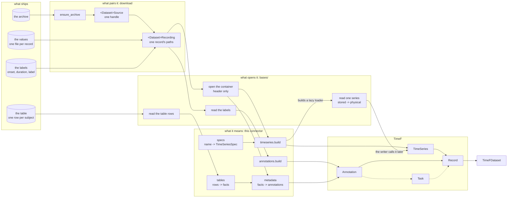

# Heads, censuses, and the map

Reference for phase 1 of the `add-dataset-connector` skill.

**How to read this.** The method is general. Examples are marked *Sleep-EDF:* and come from
`physionet/sleep_edfx`; a number marked *(measured)* was counted over that one release. Your dataset
will have different files, different shapes and different numbers, and the same three questions.

This phase answers those three questions, and each has its own tool:

| question | tool | cost |
| --- | --- | --- |
| What shape is one file of this kind? | a `head()` | one small read per file type |
| What is odd about this release? | a census | one walk, one table |
| How do the files reach TimeF? | the map | no reads at all |

## The budget

**The context cost of phase 1 does not grow with the size of the release.** A release of 200
recordings and one of 200 000 both give three heads and one census table. Hold that invariant. It is
what keeps this phase possible on a dataset you cannot download twice.

Three rules follow from it:

- One head for each file **type**, never one per file.
- A head is bounded by construction, not truncated after the read. `head_signals` on an 8 GB release
  reads one block of the container, not one whole file.
- The census walks every file, but only its table enters the conversation. Run the walk in a
  subagent and take back the table alone.

## Give every raw file type a `head()`

A connector reads more than one kind of file, and the kinds are not alike. Typically there is one
kind holding signals, one holding labels, and a table of per-subject facts beside them. Each kind
has its own shape, and few of them open in an editor.

- *Sleep-EDF:* three kinds — a container of signals, a container of annotations, and a spreadsheet
  of subjects. *ECG-QA:* WFDB records and three CSV files.

A `head()` opens one file, reads a small part of it, and gives that part back as text a person can
read. It writes nothing and it changes nothing.

**No connector ships a `heads.py` yet.** This is a new convention, introduced with this skill, so
there is nothing in the tree to copy — you are writing the first one. Put it in `heads.py` beside
the connector, one function per kind, named for the kind and not for the file extension. These
signatures are the shape to follow, not existing code:

```python
def head_signals(path: Path, blocks: int = 1) -> str: ...
def head_annotations(path: Path, rows: int = 5) -> str: ...
def head_subjects(path: Path, rows: int = 5) -> str: ...
```

Each gives a string, so a caller can print it, write it to a file, or put it in a test. Each reads
only the part it prints.

### What each kind should print

- **signals** — the header fields, then one block of data: the signal names, their rates, their
  units, and the first values of each.
- **annotations** — the first rows as `onset, duration, label`, with the count of rows.
- **tables** — the header row and the first data rows of the sheet.

### Why they ship with the connector

- **Scaffolding.** You cannot design a TimeF record before you have seen the raw shape. The
  questions that decide the design are all questions about the source: how many series, at which
  rates, in which units; is a label one row per window or one row per run of equal windows; which
  columns of the table identify the record.
- **Review.** A reader who does not know the source sees the raw shape beside the connector that
  maps it, and can judge whether the mapping is right.
- **A first check on a new release.** Run the heads against a new version of the dataset. A changed
  shape shows at once.

## Census the release

A census is a count, and its purpose is to find where two records differ.

**You cannot find the odd values by reading.** An anomaly worth knowing is almost always a fact
about the *set*: one file in a hundred that differs, a value that varies per file where you assumed a
constant, a table that disagrees with the headers for a handful of rows. Reading one file finds none
of them, however carefully you read it.

The signature of a shape is:

- the series names, with their units and their rates,
- the labels the annotations use,
- the shape of the table row the record joins to.

Run the signature over every set of files and count the groups. Write the result as one column per
group, one row per property that differs:

| | shape A | shape B |
| --- | --- | --- |
| records | | |
| series per record | | |
| the rate of each | | |
| names that differ for the same kind of thing | | |
| the table row it joins to | | |
| encodings that differ between groups | | |

Then, beside it, the properties that vary *within* a group and are therefore not shape at all.

- *Sleep-EDF:* the census gives two groups, `sleep-cassette` (153 recordings, 7 signals, 30 s
  records with one file at 60 s) and `sleep-telemetry` (44 recordings, 5 signals, 10 s records)
  *(measured)*. The same signal name `EMG submental` runs at 1 Hz in one and 100 Hz in the other;
  the marker signal is named differently in each; the two sheets even encode sex in opposite
  directions, `F=1, M=2` against `M=1, F=2`. One group states 117 distinct physical ranges across
  its 153 files, the other one range for all 44.

**A census that finds two shapes does not mean two modules.** It says where the code must take a
value instead of a constant, and that is all it says. Every row of such a table is one of two
things: a value the file states in its own header, or a value the description states as data.
Neither is a branch on which part of the release you are in.

**Leave out of the signature what varies file by file.** Per-file calibration is not shape. If the
census gives one group per file the signature is too strict; if it gives one group for the whole
release it is too loose, and you have not yet found the property that separates them.

**Then count the records**, whether or not the count is a `len()`. Prefer a count the release states
about itself — an index file, a manifest, a row count — over one you derive, and say which you used.
If you cannot count the records before you convert, you do not yet know what a record is.

## Name the set of files that one record needs

A record is not a file. It is a set of files, and usually a row of a table beside them. Name each
role the set needs — the values, the labels on those values, and the key into any table beside them —
before deciding what to hand between the two halves of the connector.

- *Sleep-EDF:* a signals file, the scoring file sharing its prefix, and one row of a subject
  spreadsheet keyed by `(subject, night)`.

Four rules hold while you name them:

- **Find out where the join key lives, and do not assume it is inside the file.** Released data is
  often de-identified, so the field that would name the subject is blanked and only the filename
  carries the identity. A connector keyed on file contents cannot then be written at all.
  - *Sleep-EDF:* the patient id field reads `X F X Female_33yr` in every file. Only the filename
    states which subject and which night.
- **Do not guess a name you can match.** Where two files of one record differ by something you
  cannot derive — an annotator's initial, a version suffix, a timestamp — match on the prefix they
  share and raise when the count of matches is not exactly one. Guessing gives a connector that
  silently skips records.
- **Name the files that no record needs.** Index files, checksums and per-release manifests belong
  to no record. Say so once, so the next reader does not look for them again.
- **Resolve, and open nothing.** `download` fetches, extracts and checks that each file is there. It
  parses no header and reads no row.

## Choose the download shape

Two shapes are possible, and the plan must pick one:

- **A list, one entry for each record.** `download` gives a frozen dataclass of resolved paths per
  record, and `convert` pairs nothing. It reads well, and the length of the list is the count of
  records.
- **One handle, walked at convert time.** `download` gives a single value that names the directories
  and the tables. `convert` walks it and yields one recording at a time. Nothing holds every
  recording at once.

**The list shape does not scale and the handle shape does.** A list of 197 entries costs nothing, but
a release of millions would build millions of dataclasses before the first record is written. The
handle shape is the same code at both sizes. Pick per dataset, and never assume.

How the release encodes its files decides what the handle carries:

- **One file per role, one set per record** — name each role.
- **One file holding many records** — a path and a key: the row range, the record name, the group
  inside the HDF5. A path alone does not name a record.
- **A table beside the files** — carry the key and the table's path, never a parsed row. A parsed row
  would mean `download` read the table, and reading is `convert`'s half.

## Draw the map

Four columns, always the same: what the release ships, what pairs it into records, what opens each
container, and what each of its parts means. Then TimeF on the right. Node names are yours; the
columns are not.



Read the columns, not the nodes. The left column is whatever your release ships; the second is
`download`'s half, which resolves paths and opens nothing; the third is the shared readers in
`bases/`; the fourth is the modules that name your dataset. A release with one kind of file has a
thinner picture and the same four columns.

Four rules make the map a check and not a picture:

- **Every file type from the inventory is a node.** A file with no arrow reaching TimeF is a file you
  have not yet placed. That is how the files no record needs get named instead of forgotten.
- **A dashed arrow is a part that is not written.** Keep it in the picture: a missing edge is easier
  to see than missing code. Tasks usually start dashed, because series must exist before an
  annotation can name them.
- **One arrow, one function.** An arrow that needs two sentences is two arrows.
- **Nothing in the map changes per study.** One spec table holds every signal name of the release,
  and every rate comes from a header, so the same arrows draw both shapes the census found.

Read the map right to left when you design: start from the record you want, and ask which file states
each part of it. Read it left to right when you code.
