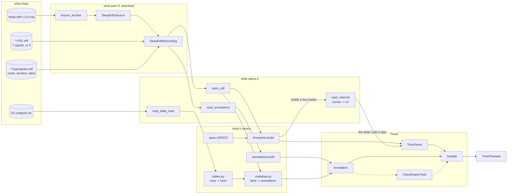

# Heads, censuses, and the map

Reference for phase 1 of the `add-dataset-connector` skill. This phase answers three questions, and
each has its own tool:

| question | tool | cost |
| --- | --- | --- |
| What shape is one file of this kind? | a `head()` | one small read per file type |
| What is odd about this release? | a census | one walk, one table |
| How do the files reach TimeF? | the map | no reads at all |

## The budget

**The context cost of phase 1 does not grow with the size of the release.** A release of 200
recordings and one of 200 000 both give three heads and one census table. Hold that invariant. It is
what keeps this phase possible on a dataset you cannot download twice.

Three rules follow from it:

- One head for each file **type**, never one per file.
- A head is bounded by construction, not truncated after the read. `head_signals` on an 8 GB release
  reads one record, not one recording.
- The census walks every file, but only its table enters the conversation. Run the walk in a
  subagent and take back the table alone.

## Give every raw file type a `head()`

A connector reads more than one kind of file, and the kinds are not alike. Sleep-EDF reads three: a
`*-PSG.edf` of signals, a `*-Hypnogram.edf` of annotations, and a `.xls` table of subjects. ECG-QA
reads WFDB records and three CSV files. Each kind has its own shape, and none of them opens in an
editor.

A `head()` opens one file, reads a small part of it, and gives that part back as text a person can
read. It writes nothing and it changes nothing.

**No connector ships a `heads.py` yet.** This is a new convention, introduced with this skill, so
there is nothing in the tree to copy — you are writing the first one. Put it in `heads.py` beside
the connector, one function per kind, named for the kind and not for the file extension. These
signatures are the shape to follow, not existing code:

```python
def head_signals(path: Path, records: int = 1) -> str: ...
def head_annotations(path: Path, rows: int = 5) -> str: ...
def head_subjects(path: Path, rows: int = 5) -> str: ...
```

Each gives a string, so a caller can print it, write it to a file, or put it in a test. Each reads
only the part it prints.

### What each kind should print

- **signals** — the header fields, then one data record: the channel names, their rates, their
  units, and the first values of each.
- **annotations** — the first rows as `onset, duration, label`, with the count of rows.
- **tables** — the header row and the first data rows of the sheet.

### Why they ship with the connector

- **Scaffolding.** You cannot design a TimeF sample before you have seen the raw shape. The
  questions that decide the design are all questions about the source: how many channels, at which
  rates, in which units; is a label one row per epoch or one row per run of equal epochs; which
  column holds the subject and which holds the night.
- **Review.** A reader who does not know the source sees the raw shape beside the connector that
  maps it, and can judge whether the mapping is right.
- **A first check on a new release.** Run the heads against a new version of the dataset. A changed
  shape shows at once.

## Census the release

A census is a count, and its purpose is to find where two samples differ.

**You cannot find the odd values by reading.** Every anomaly that mattered in Sleep-EDF was a fact
about the set, not about any one file: one file of 152 writes 60 s records, there are 117 distinct
physical ranges across 153 files, 24 recordings have a header that disagrees with the subject table,
26 scorings start after their signals do. Reading one file would have found none of them.

The signature of a shape is:

- the channel names, with their units and their rates,
- the labels the annotations use,
- the shape of the table row the sample joins to.

Run the signature over every set of files and count the groups. Sleep-EDF gives two:

| | `sleep-cassette` | `sleep-telemetry` |
| --- | --- | --- |
| recordings | 153 | 44 |
| channels | 7 | 5 |
| record duration | 30 s, and 60 s in one file | 10 s |
| `EMG submental` | 1 Hz | 100 Hz |
| the marker channel | `Event marker`, no unit, 1 Hz | `Marker`, unit `ID+M-E`, 10 Hz |
| table row | one for each recording | one for each subject, two nights in columns |
| sex code | `F=1, M=2` | `M=1, F=2` |
| physical range | 117 distinct across 153 files | one, for all 44 |

**A census that finds two shapes does not mean two modules.** It says where the code must take a
value instead of a constant, and that is all it says. Every row above is one of two things: a value
the file states in its own header, or a value the description states as data. Neither is a branch on
the study.

**Leave out of the signature what varies file by file.** Every cassette file states its own physical
range, so one count is 20.6769 uV in one file and 22.9538 uV in another. That is calibration, not
shape. If the census gives one group per file, the signature is too strict.

**Then count the samples**, whether or not the count is a `len()`. Sleep-EDF holds 197 recordings,
one for each line of `RECORDS` *(measured)*. If you cannot count the samples before you convert, you
do not yet know what a sample is.

## Name the set of files that one sample needs

A sample is not a file. It is a set of files, and usually a row of a table beside them. For Sleep-EDF
one sample needs three things:

- `sleep-cassette/SC4001E0-PSG.edf` — the signals.
- `sleep-cassette/SC4001EC-Hypnogram.edf` — the scoring of those signals.
- one row of `SC-subjects.xls`, keyed by `(subject, night)`.

Four rules hold while you name them:

- **The join key comes from the filename.** The EDF files are anonymous: the patient id field reads
  `X F X Female_33yr`, and nothing inside a file names its subject. Only `SC4001E0` states that this
  is subject 0, night 1. A connector whose key comes from file contents cannot be written for this
  release.
- **Do not guess a name you can match.** The initial of the technician who scored a hypnogram sits at
  the end of its filename, and the PSG name does not predict that letter. Match on the prefix the two
  names share, and raise when the count of matches is not one.
- **Name the files that no sample needs.** `RECORDS`, `RECORDS-v1` and `SHA256SUMS.txt` sit at the
  root of this release and belong to no sample. Say so once, so the next reader does not look for
  them again.
- **Resolve, and open nothing.** `download` fetches, extracts and checks that each file is there. It
  parses no header and reads no row.

## Choose the download shape

Two shapes are possible, and the plan must pick one:

- **A list, one entry for each sample.** `download` gives a frozen dataclass of resolved paths per
  sample, and `convert` pairs nothing. It reads well, and the length of the list is the count of
  samples.
- **One handle, walked at convert time.** `download` gives a single value that names the directories
  and the tables. `convert` walks it and yields one recording at a time. Nothing holds every
  recording at once.

**The list shape does not scale and the handle shape does.** A list of 197 entries costs nothing, but
a release of millions would build millions of dataclasses before the first sample is written. The
handle shape is the same code at both sizes. Sleep-EDF gives one handle. Pick per dataset, and never
assume.

How the release encodes its files decides what the handle carries:

- **One file per role, one set per sample** — name each role.
- **One file holding many samples** — a path and a key: the row range, the record name, the group
  inside the HDF5. A path alone does not name a sample.
- **A table beside the files** — carry the key and the table's path, never a parsed row. A parsed row
  would mean `download` read the table, and reading is `convert`'s half.

## Draw the map

Four columns, always the same: what the release ships, what pairs it into samples, what reads the
container, and what each of its parts means. Then TimeF on the right.



Four rules make the map a check and not a picture:

- **Every file type from the inventory is a node.** A file with no arrow reaching TimeF is a file you
  have not yet placed. That is how the files no sample needs get named instead of forgotten.
- **A dashed arrow is a part that is not written.** Keep it in the picture: a missing edge is easier
  to see than missing code. Tasks usually start dashed, because series must exist before an
  annotation can name them.
- **One arrow, one function.** An arrow that needs two sentences is two arrows.
- **Nothing in the map changes per study.** One spec table holds every channel name of the release,
  and every rate comes from a header, so the same arrows draw both shapes the census found.

Read the map right to left when you design: start from the sample you want, and ask which file states
each part of it. Read it left to right when you code.
