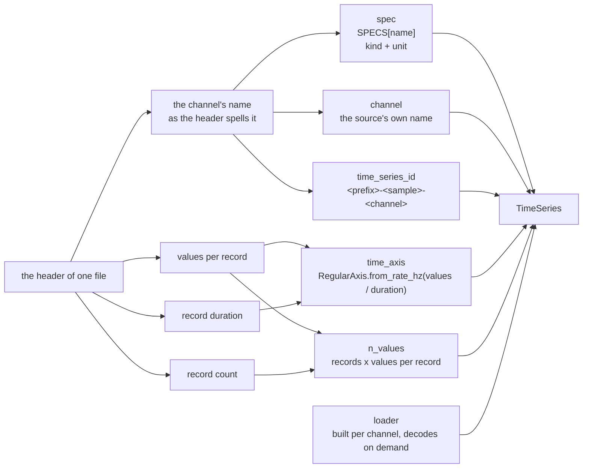

# How the modules of a connector divide

Reference for the `add-dataset-connector` skill. The plan states the skeleton in phase 1; phase 4
builds it. This file says what goes where and why.

**How to read this.** The rules are general. Two kinds of dataset-specific text appear below and they
are not the same thing: a **citation** such as `sleep_edfx/connector.py` points at code in this repo
that shows a convention is real and followed — a reviewer checks those. An **illustration** marked
*Sleep-EDF:* shows one shape a rule can take, and never narrows it. Where a template uses
`<placeholders>`, they are yours to fill.

## Contents

- [The one rule that places every module](#the-one-rule-that-places-every-module)
- [The folder](#the-folder)
- [What each module may do](#what-each-module-may-do)
- [Two rules that follow](#two-rules-that-follow)
- [`convert` holds the loop](#convert-holds-the-loop)
- [The lazy loader is I/O too, and it runs after `convert` has returned](#the-lazy-loader-is-io-too-and-it-runs-after-convert-has-returned)
- [Building the series](#building-the-series)
- [The survey decides values, not modules](#the-survey-decides-values-not-modules)
- [Dependencies](#dependencies)
- [Tests](#tests)
- [Names a connector reuses](#names-a-connector-reuses)
- [The keys a connector writes](#the-keys-a-connector-writes)
- [Dedupe a closed set through one holder, not through an id literal](#dedupe-a-closed-set-through-one-holder-not-through-an-id-literal)
- [A `Protocol` keeps the import one way](#a-protocol-keeps-the-import-one-way)
- [Comments explain the release, not the code](#comments-explain-the-release-not-the-code)
- [Not a rule: docstring voice](#not-a-rule-docstring-voice)
- [Still unsettled](#still-unsettled)

## The one rule that places every module

**The module that reads a file must not be the module that says what its contents mean.** Each module
can then be read on its own, and half of them need no fixture to test.

`connector.py` orchestrates. Nothing below it drives. It walks the release, opens what it needs, and
hands what it opened to the functions that give it meaning. Those functions open nothing and walk
nothing.

## The folder

```
packages/timenet-connectors/src/timenet_connectors/datasets/<org>/<name>/
  __init__.py      # re-exports CONNECTOR (and the class) from connector.py
  connector.py     # the BaseConnector subclass; ends with CONNECTOR = <YourClass>
  dataset.yaml     # the dataset card, read by metadata()
  README.md        # the assumptions and the inconsistencies
  specs.py         # TimeSeriesSpec values and the channel-name map
  annotations.py   # source annotations -> Annotation
  tables.py        # rows -> facts; no I/O at all
  metadata.py      # facts -> Annotation
  tasks.py         # annotations -> Task
  keys.py          # the annotation keys, once two modules write the same one
  requirements.txt # libraries this connector needs (optional)
  tests/           # one test module per module above
```

**One rule decides whether a file belongs in that list: a file that `download` or `convert`
imports and calls is part of the connector.** Every other file you wrote to build it stays out. A
head is the common case, so `heads.py` lives at `docs/notes/connectors/<org>/<name>/heads.py` with
the plan and the survey. See `discovery.md § Where a head lives`.

**The half that opens files is a base, not a connector module.** A container format is not specific
to one dataset, so its reader is shared:

```
packages/timenet-connectors/src/timenet_connectors/bases/
  edf/reader.py      # opens EDF; decodes nothing
  edf/timeseries.py  # an EDF header -> TimeSeries
  excel.py           # reads a workbook into rows
  huggingface.py     # BaseHuggingFaceConnector
  physionet.py       # BasePhysioNetConnector
```

`physionet/sleep_edfx` ships no `reader.py` of its own. It imports
`timenet_connectors.bases.edf.reader` and `bases.excel`, and keeps only the modules that name this
dataset. A base's tests live at `packages/timenet-connectors/tests/`, beside the base and not beside
any connector.

**One test decides whether a module belongs in `bases/`: could a second connector import it
unchanged?** `bases/edf/reader.py` opens EDF files and `bases/excel.py` decodes what Excel itself
states about a cell — a whole number, a bare time as a fraction of a day. Neither names a dataset. A
code whose meaning changes between two sheets of one release stays in the connector, which is why
`tables._decode_sex` did not move.

**Lift on the second copy, not the third.** `find_dir_containing` was copied into two connectors
before it moved into `download/`.

**The library's own types stay inside the base.** `edfio` types do not leave `reader.py`; it gives
back its own `EdfHeader` and `EdfFile`, so a change of library reaches one file.

**A base is not always usable at the size you need.** `BaseHuggingFaceConnector` returns a list
holding every row of the release, so a large Hub dataset has to write its own `download` and give
back a handle instead. `discovery.md § Choose the download shape` states the limit and the numbers.
Check that the base fits the size before you build on it.

A small connector does not need all of these. `chengsenwang/tsqa` is one `connector.py`, because it
reads one parquet row per sample and there is nothing to divide. Add a module when the survey shows
a second kind of file or a second kind of meaning, not before.

**`chengsenwang/tsqa` is also the pattern for a row-shaped release that states no id and no time
axis**, which is the harder thing it demonstrates. Its corpus has neither, so `connector.py:53`
builds `sample_id=f"row-{index}"` from the row's position and `:48` gives every series an
`OrdinalAxis()` rather than inventing a rate. Read it when your release ships rows and no identity.
`fidelity.md § The data` states the rule those two lines follow.

The org folder needs its own `__init__.py`. `discovery.resolve(dataset_id)` imports only the one
module and reads its `CONNECTOR`.

## What each module may do

- **The opening modules decode nothing.** `bases/edf/reader.py` opens containers and
  `bases/excel.py` opens workbooks; neither says what the bytes mean.
  `reader.open_edf(path)` parses the header, and `reader.read_channel(file, index)` takes that open
  file.
- **`tables.py` turns rows into facts and does no I/O at all.** It imports the stdlib,
  `timenet.errors`, the pure decoders in `bases.excel`, and its own `keys` — nothing that opens a
  file. Its test passes literal tuples and creates no file.
- **`metadata.py` turns facts into annotations.** It opens no file and takes no path.
- **`specs.py` holds values only.** One `TimeSeriesSpec` per kind of channel, and one map from every
  channel name of the release to those specs.
- **`timeseries.py` builds series from a header it is handed.** It names no study, no channel and no
  file of the release.

## Two rules that follow

**Read a file one time.** Parse a header one time and pass it on. A function that takes a path while
its caller already holds the open file re-reads what has been read. Seven channels cost one header
parse, not seven.

**A function touches the disk or builds a value, never both.** The half that builds a value is then
provable with values alone, and needs no file on disk to test it.
`reader.convert_digital_to_physical` converts counts to microvolts and opens nothing.
`excel.read_table_rows` is the only function that touches the workbook, which is what lets
`test_tables.py` skip `xlrd` entirely.

## `convert` holds the loop

The loop states what a sample is. The modules below it state what the steps of that loop mean, and
drive none of them.

```python
file = reader.open_edf(recording.psg_path)
series = timeseries.build(sample_id, file, specs.SPECS, loader=reader.build_channel_loader)
```

`build` is handed an open file and a loader factory. It opens nothing, and it holds nothing of this
dataset.

## The lazy loader is I/O too, and it runs after `convert` has returned

Let the loader close over the open file. The channels of one recording then share one open file and
one memory map, and the header is parsed one time.
`reader.build_channel_loader(file, index)` holds the file that `convert` opened, so a seven-channel
sample opens its file once rather than once per series. Give a sample's series the same `source_id`
and they are read together, which is what makes one open enough.

**The cost is that whatever a loader captures stays alive until it is called, and it is called after
`convert` returns.** So a build holds every file it opened open until then. A couple of hundred open
files is fine. A hundred thousand is not, and wants a loader that reopens by path and pays the header
parse again. Say which case you are in, in the plan.

## Building the series

Three things, in this order:

1. **One `TimeSeriesSpec` for each kind of channel**, at module level in `specs.py`. Specs are frozen,
   so identical ones are equal and dedupe. Name a spec for the kind it measures, not for the channel
   that carries it.
2. **One map from every channel name of the release to those specs**, keyed by the exact string in
   the header.
3. **One builder that takes the map and gives the series.** It reads every other attribute from the
   header it is handed.

```python
_KIND = TimeSeriesSpec(
    spec_type="<kind>", name="<Kind>", unit_value=ureg.<unit>, data_source=_SOURCE
)

SPECS = {
    # Keyed by the exact string the header writes. One entry for every name the
    # release uses, including two spellings of the same thing.
    "<name as the header spells it>": _KIND,
    "<a second channel of the same kind>": _KIND,
    "<the same kind, spelled differently elsewhere in the release>": _KIND,
    "<a different kind>": _OTHER_KIND,
}
```

- *Sleep-EDF:* one `_EEG` spec serves both `EEG Fpz-Cz` and `EEG Pz-Oz`, and one `_MARKER` spec
  serves the marker channel under both the names the two parts of the release give it.

Four rules hold here:

- **The builder holds nothing of the dataset.** The caller passes the spec table and the loader
  factory.
- **Each channel keeps its own time axis.** A `RegularAxis` whose period comes from
  `samples_per_record / record_duration` for that channel.
- **Read the rate and the block duration from the header, never from a constant.** One channel name
  can run at different rates in two parts of a release, and one file can write a different block
  duration from all the others.
- **An unknown channel name raises `TimeFFormatError`.**

Every attribute of a series comes from a named field of the header. Nothing is guessed, and nothing
but the spec comes from the study:



**One spec table covers every shape the survey found.** A shared channel name is still worth a second
look, because one name can cover two different measurements. Ask whether a spec — a kind and a unit
— is still true of both, and let the header supply whatever separates them. Check every shared name
before you write one table.

- *Sleep-EDF:* `EMG submental` is a rectified envelope at 1 Hz in one part of the release and a raw
  trace at 100 Hz in the other. Both are EMG in microvolts, which is what the spec states, and the
  rate that separates them comes from the header — so the shared name costs nothing here.

## The survey decides values, not modules

A survey that finds two shapes does not mean two modules. Every difference it found is one of two
things:

- **A value the header states** — channels, rates, record duration, physical range. The builder reads
  them and knows nothing of either study.
- **A value the description states as data** — the header rows to skip, the columns to take by
  position, the key of a row, the map of its sex column. These are the fields of one frozen
  description type: `tables.SheetShape`, of which `CASSETTE_SHEET` and `TELEMETRY_SHEET` are two
  values. A new sheet is a new value, not a new module, and no function in `tables.py` names a study.

**Where two parts of a release differ, the difference is a value of one type, never an `if` on which
part you are in.** That is the whole rule, and the survey is what tells you which fields the type
needs.

## Dependencies

**One question decides where an import goes: does importing this module cost somebody who never uses
the library?** Answer it against `discovery.available()`
(`packages/timenet-connectors/src/timenet_connectors/discovery.py:157-178`), whose own docstring
says:

> This imports each connector module. Use it for listings and error messages, not the build hot path.

It walks every package under `datasets/` and imports each one to read its `CONNECTOR`. A module-level
import in **any** connector module therefore runs for **every** connector. A connector that put
`import huggingface_hub` at the top of its `connector.py` would make `available()` raise in an
environment without that library, and dataset listing would break for everybody because one connector
declared a dependency.

Two cases follow, and where the library is declared says which one you are in:

- **A library the whole package already depends on imports at the top.** `pyarrow` is a core
  `timenet` dependency (`packages/timenet/pyproject.toml:28`), so every environment that can import
  the package has it and a top-level import costs nobody. The stdlib, `timenet` and
  `timenet_connectors` are the same case.
- **A library only this connector declares in its `requirements.txt` is imported inside the function
  that uses it**, with `# noqa: PLC0415` and a reason. Nothing else in the environment promises that
  library, so a top-level import charges every other connector for it. Raise an `ImportError` naming
  the connector's `requirements.txt` and the `--no-isolation` escape hatch, as
  `bases/huggingface.py:47-52` does:

  ```python
  try:
      from huggingface_hub import snapshot_download  # noqa: PLC0415 (see the comment above)
  except ImportError as exc:
      raise ImportError(
          f"reading {self.HF_REPO!r} needs huggingface_hub, declared in this connector's "
          "requirements.txt. Run the build without --no-isolation, or install it yourself"
      ) from exc
  ```

**A base defers for the same reason, not a different one.** A base that **every** connector reaches
through — `bases/huggingface.py:47`, `bases/physionet.py:84`, `download/s3.py:40` — imports its
library inside the function, because every connector pays for that module. A base that only its
**declaring** connector imports — `bases/edf/reader.py`, `bases/excel.py` — imports at the top,
because nothing else reaches it and there is nobody to protect.

**A requirement is declared twice.** Once in the connector's `requirements.txt`, which the build
installs into the environment the build runs in, and once in the root dev group, which is what puts
it in your own environment. `make sync` is `uv sync --all-groups --all-extras`, and a
`requirements.txt` is neither a group nor an extra, so syncing alone will not install it. Without
the second declaration `ty` reports the deferred import as unresolved and the connector's test cannot
run.

**Every deferred import states its reason**, in the `noqa` or in a comment above it, so a later
reader can retire it rather than guess at it.

## Tests

Tests live beside their connector in `<org>/<name>/tests/`, one module per module they cover. The
split above decides what each needs:

**The repo ships no dataset bytes. Nothing is checked into a `fixtures/` directory, and no such
directory exists.** A test builds what it needs, synthetically, and says so in a comment:

- **A pure module needs no fixture at all.** `test_tables.py` passes literal tuples. This is the
  payoff of keeping `tables.py` free of I/O, and the plan names which modules get it.
- **A row-shaped source is a literal in the test module.** `tsqa` hand-writes rows shaped exactly
  like the Hub's, with a comment saying they are not derived from the real dataset.
- **A file-shaped source is written at run time into `tmp_path`.** `sleep_edfx` writes a synthetic
  release of two cassette recordings from a fixture factory, then runs the connector over it.
- **The connector test calls `convert()` directly**, with no network.

Writing the release rather than checking one in is what lets a test cover the odd cases the real
release holds: a recording with no scoring beside it, one with two, one missing a scored channel.
You cannot check in a fixture for a case the release does not contain.

No connector reads an environment variable, and the ones some older docs name do not exist — see
`AGENTS.md § Things that surprise you once`.

## Names a connector reuses

| The thing | The shape | Seen in |
| --- | --- | --- |
| What `download_async` returns | `<Dataset>Source` | `EcgQaCotSource`, `SleepEdfxSource` |
| One item streamed out of it | `<Dataset>Recording` / `<Dataset>Row` | `SleepEdfxRecording` |
| The generator that streams them | `_iter_<plural>(source)` | `_iter_recordings`, `_iter_cot_rows` |
| A method building the series of one ref | `_<plural>_for(...)` | `_leads_for` |
| The one public builder of a module | `build(...)` | `annotations.build`, `timeseries.build` |
| One named builder among several | `build_<thing>(...)` | `build_age`, `build_epoch_tasks` |
| A function that computes an id | `name_<thing>(...)` | `tasks.name_vocabulary` |
| A parser reading one value out of a name | `_parse_<thing>(...)` | `_parse_subject_id` |
| The connector's id prefix | `_ID_PREFIX`, one module-level constant | `sleep_edfx/connector.py` |

Because `download_async` gives one handle and not a list per sample, `convert` starts
`source = raw_refs[0]`. The name `raw_refs` comes from `BaseConnector[TRaw]` and is not iterated.

`__init__.py` re-exports with explicit self-aliases, so a re-exported name is unambiguously public
to a type checker rather than an incidental import:

```python
from timenet_connectors.datasets.physionet.sleep_edfx.connector import (
    CONNECTOR as CONNECTOR,
    SleepEdfxConnector as SleepEdfxConnector,
)
```

Fetch an archive with `ensure_archive`, then locate it with
`find_dir_containing(root, "<a file at the archive root>")`. Archives extract nested, and the helper
searches with `rglob`, so you never have to guess the layout the archive produced.

## The keys a connector writes

**Once more than one module writes the same annotation key or task name, they move into a `keys.py`
of `StrEnum` classes.** A `StrEnum` member is a `str`, so it passes straight into
`Annotation(key=...)` and compares equal to the literal a test asserts. One module writing bare
literals cannot drift, so `ecg_qa_cot` keeps them. Two modules is the line.

**A description belongs to the key, not to the value.** Every value of one key means the same kind
of thing, so the description sits in a `dict` keyed by the key, and not in each call that builds an
annotation.

## Dedupe a closed set through one holder, not through an id literal

Two connectors solve this two ways, and the newer one is better.

- `sleep_edfx` holds `MetadataAnnotation`: an object that builds the annotation for a value on first
  sight and gives the same instance back after. Nothing computes an id, and nothing can disagree.
- `ecg_qa_cot` computes a stable id from the value and repeats that call at both ends — once where
  the annotation is built, once where a streamed task references it. It has to, because the task
  stream never sees the annotation objects.

**Use the holder wherever the annotation and its consumer are in one pass.** Fall back to a
value-derived id only when a stream reads the annotation back without holding it, and then route
both ends through one function so they cannot drift.

## A `Protocol` keeps the import one way

`metadata.RecordingIdentity` is a `Protocol` naming the four fields it reads off a recording.
`SleepEdfxRecording` matches it without declaring so. The connector imports `metadata`, and
`metadata` imports no connector. Reach for this when a helper module needs the shape of a value that
`connector.py` owns.

## Comments explain the release, not the code

A comment in a connector answers "why does the data look like this". A reader who knows Python still
needs it.

```python
# A label file's name ends with the initial of the technician who wrote it. The signal file's
# name does not predict that letter. Match on the prefix the two names share instead.
```

**A module docstring states what the module does not do.** "This module reads no file." "Nothing
here takes a path." That one line is what makes the split between I/O and meaning checkable by
reading a docstring instead of the imports.

## Not a rule: docstring voice

The two connectors are written in two voices and neither has won. `sleep_edfx` writes "Give the id
of the person a recording belongs to"; `ecg_qa_cot` writes "Return the integer ecg_id". Match the
connector you are in, and do not rewrite the other one on the way past.

## Still unsettled

Named here so nobody resolves one by accident and calls it a convention.

- **Where a survey lives.** A test that fails when a release grows a third shape would be the
  strongest version of it, but it needs the full download.
- **Whether the spec table is code or data.** The channel-to-spec map could sit in `dataset.yaml`
  beside the card. Code keeps it type-checked; data keeps it readable to somebody who does not read
  Python.
- **How a sample states which part of a release it came from**, other than by an annotation.
- **How far the lazy loaders scale.** Every file a loader captures stays open until it is called. A
  couple of hundred is fine; a hundred thousand is not, and would want a loader that reopens by path
  and pays the header parse again. Nobody has fixed the number where that flips.
- **Whether a `head()` should reach the CLI** (`timenet-build head <id>`). It is settled that a head
  is not a connector module: it lives with the discovery record and does not ship. Whether the build
  CLI grows a command for one is open.
