# TimeNet

[](https://pypi.org/project/timenet/)
[](https://docs.timenet.ai/)
[](LICENSE)

TimeNet is a Python library and CLI for registering, fetching, and exploring time-series datasets
in a shared format called TimeF. Every dataset gets one on-disk shape and one way to load it, so a
consumer reads ECGs, accelerometer traces, and market series through the same API.

TimeNet is not a modeling toolkit. Training, inference, model definitions, and evaluation metrics
are out of scope. It stops at handing you the data.

Full documentation: <https://docs.timenet.ai/>

## How it fits together



A connector turns a raw source into a manifest plus parquet and publishes it to a registry. The
client reads the manifest from the registry and loads the data. Reading never runs connector code,
so everything a consumer needs to interpret the parquet lives in the manifest.

- `BaseConnector` is the only contract a new data source must satisfy.
- `TimeFDataset` is the in-memory model a connector populates during `convert()`.
- `TimeFWriter` serializes a populated `TimeFDataset` to disk.
- `TimeFReader` reads a TimeF version directory back into a `TimeFDataset`.

## Components

The project is a [uv](https://docs.astral.sh/uv/) workspace with two packages under `packages/`,
plus the registry they read from and write to.

| Part | What it is | Ships |
| --- | --- | --- |
| `timenet` | the SDK and CLI | the TimeF format, reader/writer, registry client, engine, `BaseConnector` |
| `timenet-connectors` | the producer package | connector recipes, dataset cards, and the `timenet-build` CLI |
| registry | a served location | compiled manifests plus parquet; can be public, a private internal one, or a local directory |

See the [architecture guide](https://docs.timenet.ai/architecture.html) for the full map, and the
[concepts page](https://docs.timenet.ai/concepts.html) for the terminology.

## Install

Requires Python 3.11 or newer (tested on 3.11 to 3.13).

```bash
uv add timenet            # core: TimeF format, reader/writer, registry client
uv add 'timenet[cli]'     # add the timenet console command
uv add 'timenet[torch]'   # add load_torch (PyTorch Dataset); works with any torch build
```

Once installed, the CLI is available as `timenet`. See [Get started](https://docs.timenet.ai/get-started.html)
to load your first dataset.

## Development

Clone the repo and set up the environment with uv:

```bash
git clone https://github.com/OpenTSLM/TimeNet.git
cd TimeNet
make sync           # install the dev environment (workspace + extras)
make install-hooks  # set up pre-commit hooks (run once after cloning)
```

This project uses uv for environment and dependency management, [ruff](https://docs.astral.sh/ruff/)
for linting and formatting, [ty](https://github.com/astral-sh/ty) for type checking, and
[Zensical](https://zensical.org/) for docs.

### Make targets

```bash
make sync           # install the dev environment (workspace + extras, CPU torch)
make test           # core tests in the dev environment
make test-unit      # the in-memory part of `make test`, for a fast answer
make test-connectors # each connector's tests in its own environment
make check          # format + lint + typecheck (ruff format, ruff check, ty check)
make check-ci       # what CI checks: the hooks, plus ty on 3.13 and on 3.11
make lint-fix       # auto-fix lint issues with ruff
make build          # build both packages with uv
make docs           # build the docs into site/
make docs-serve     # serve the docs locally at http://127.0.0.1:8000
make install-hooks  # install pre-commit hooks (run once after cloning)
make clean          # remove .venv, caches, and built site/
```

### Verification

Run these before opening a PR, and make them pass:

- `make check` for `ruff format`, `ruff check`, and `ty check`
- `make lint-fix` to auto-fix lint findings
- `make test` for the pytest suite

Every commit runs the same ruff, ty, `uv lock`, and file-hygiene checks through pre-commit. Don't
bypass hooks with `--no-verify`; if one fails, run `make check` / `make lint-fix` and commit again.

CI runs the checks as four jobs. The `quick` job answers in about 40 seconds with the hooks, the
type checks, and the tests in `make test-unit`. The `tests` and `tests_min` jobs wait for `quick`,
then run the full suite on Python 3.13 and on Python 3.11. A branch that fails `quick` therefore
costs one runner minute, not seven. The `check` job collects the three results, and it is the one
required status check.

### Docs

`make docs-serve` gives a live preview at http://127.0.0.1:8000; `make docs` builds the static site
into `site/`. Published at <https://docs.timenet.ai/>, deployed from `main` by
`.github/workflows/docs.yml`.

## License

TimeNet is released under the [MIT License](LICENSE).

### Dataset licenses

The MIT License covers TimeNet's own code, not the datasets it fetches. Each dataset keeps its
upstream license. Check the `license` and `source_url` fields on a dataset's card to see what applies
and where the data comes from. Some sources, such as PhysioNet, only grant credentialed access, so
follow their terms when you download. See
[Dataset licensing](https://docs.timenet.ai/catalog/licensing/) for the full note.
