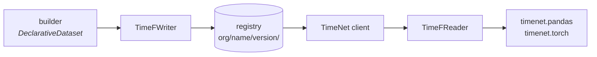

# TimeNet

*Download and explore time-series datasets through one standardized format.*

> [!NOTE]
> This is a pre-release version and is subject to change. We are actively working on
> improvements around performance and integrations, and welcome community contributions.

[](https://pypi.org/project/timenet/)
[](https://docs.timenet.ai/)
[](https://github.com/OpenTSLM/TimeNet/blob/main/LICENSE)

Time-series data is fragmented. TimeNet standardizes it. Every dataset used to ship in its own
shape, forcing teams to rewrite the same loading code again and again. TimeF replaces that with
one shared format and one set of tools to find, download, and load any dataset the same way,
whether it holds ECGs, accelerometer traces, or market prices.

TimeNet hands you the data and stops there. Training, inference, and modeling are up to you.

We're actively growing TimeNet: adding datasets, integrating time-series ML models, and building
bridges to data processing libraries. Contributions in any of these areas are welcome.

Full documentation: <https://docs.timenet.ai/>

## How it fits together

A dataset version is one directory: a `manifest.json`, one embedded DuckDB database holding the
control plane, and the values plane beside it as Parquet shards or a Zarr store. A registry serves
those directories. The client reads the manifest and opens the version; the reader answers questions
about it in SQL and pulls values through whichever backend wrote them.



Nothing on the read path runs producer code. Everything a consumer needs to interpret a version is
in the version.

## The two planes

| | What it holds | How it is stored | Why |
| --- | --- | --- | --- |
| control plane | records, source trees, signals, tasks, annotations, chunk locators | one `control.duckdb` | small, deeply cross-referenced, read by point lookups, joins, and tree walks |
| values plane | the sample values of every signal | Parquet shards, or Zarr with the `zarr` extra | bulk numeric data read by random access at a known offset |

See the [architecture guide](https://docs.timenet.ai/architecture.html) for the full map, and the
[concepts page](https://docs.timenet.ai/concepts.html) for the terminology.

## Install

Requires Python 3.11 or newer (tested on 3.11 to 3.13).

```bash
uv add timenet             # core: TimeF format, reader/writer, registry client
uv add 'timenet[torch]'    # timenet.torch; works with any torch build
uv add 'timenet[zarr]'     # read and write a Zarr values plane
uv add 'timenet[s3]'       # an s3:// registry
```

See [Get started](https://docs.timenet.ai/get-started.html) to write and read your first dataset.

## Working on TimeNet

This is a [uv](https://docs.astral.sh/uv/) workspace. `make sync` installs the dev environment,
`make check` runs `ruff format`, `ruff check` and `ty check`, `make test` runs the test suite, and
`make docs` builds the documentation site. `AGENTS.md` has the full contributor workflow.

## License

TimeNet is released under the [MIT License](https://github.com/OpenTSLM/TimeNet/blob/main/LICENSE).

### Dataset licenses

The MIT License covers TimeNet's own code, not the datasets it fetches. Each dataset keeps its
upstream license. Check the `license` and `source_url` fields in a version's manifest to see what
applies and where the data comes from. Some sources, such as PhysioNet, only grant credentialed
access, so follow their terms when you download. See
[Dataset licensing](https://docs.timenet.ai/catalog/licensing/) for the full note.
