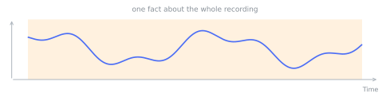
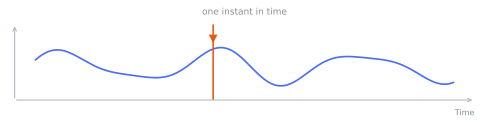
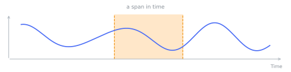
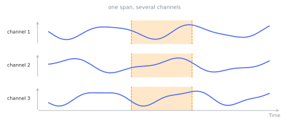

# Annotations

An annotation is side-information attached to a [sample](samples.md). Every annotation has two parts.
The **scope** says which channels and which point or window in time the annotation refers to. The
free-text **content** can be as short as a tag or as long as a paragraph of reasoning. One
`Annotation` class covers every case. The optional `span` says how the annotation sits in time.
Annotations are timeline events. That span is a `TimePoint` or a `TimeInterval`. Both read as
microseconds on the source recording timeline. The step frame (`StepPoint` and `StepInterval`,
counted in a series' own ordinals) is for [tasks](tasks.md) on an ordinal series. Annotations do not
use it. The `Annotation` class is a keyword-only frozen dataclass with `key`, `value`, `unit` and
`description` fields. A connector authors it directly, or subclasses it with field defaults for
reuse.

## Sample-wide facts

An `Annotation` with no `span` has no time reference. It describes the whole recording. It requires a
`value`. Sample-level facts live here: the machine id, its firmware version, an operating mode, or a
single condition label. This label travels with every window drawn later from the sample.

```python
from timenet.types import Annotation

Annotation(key="condition", value="healthy")
Annotation(key="operating_hours", value=1200, unit="hours")
```

<figure markdown="span">
  
</figure>

## One time offset

An `Annotation` whose `span` is a `TimePoint` marks one time offset on one or more channels. This
shape fits discrete events: a shock, a valve actuation, a detected spike. Points are cheap to store.
Detectors often produce them in bulk. Points then serve as anchors for downstream windowing. To
target specific channels, pass `time_series_ids`. To target the whole sample, leave it `None`. A
`TimePoint` reads its offset as microseconds on the source recording timeline. `seconds()` converts
from recording seconds for you.

```python
from timenet.types import Annotation, TimePoint

Annotation(key="impact", span=TimePoint.seconds(4.2, time_series_ids=("vibration",)))
```

<figure markdown="span">
  
</figure>

## A bounded window

An `Annotation` whose `span` is a `TimeInterval` covers a start-to-end window on one or more
channels. This span is the most common one. The half-open range `[start, end)` must have an end that
exceeds its start. The full scoping grammar lives here: which channels by which time range. The
`value` and free-text `description` can carry the full reading of what happens in that window.

```python
from timenet.types import Annotation, TimeInterval

Annotation(
    key="fault",
    value="bearing fault",
    span=TimeInterval.seconds(5.0, 8.0, time_series_ids=("vibration",)),
)
```

<figure markdown="span">
  
</figure>

## Across channels

Annotations are not tied to one channel. A single event can span a vibration sensor, a temperature
probe, and a current sensor together. The shared timing indicates one physical process, not a
per-channel artifact.

<figure markdown="span">
  
</figure>

A sample holds a *list* of annotations. Several spans can sit on one channel. Windows can overlap or
nest. All three ways of sitting in time can coexist on one signal. The text field is free-form, so an
annotation can carry a multi-sentence reading rather than a label. This reading lets the annotation
become a reasoning target. That is the bridge to [tasks](tasks.md).
