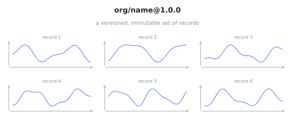

# Datasets

A dataset is a versioned collection of [samples](samples.md), addressed as `org/name@version` (for
example `chengsenwang/tsqa@1.0.0`). The id is a HuggingFace-style `org/name` pair; the version is the
upstream source's semantic version.

<figure markdown="span">
  
</figure>

## Versions are immutable

A version is committed atomically once its `manifest.json` lands, and it never changes after that.
Pinning `@version` gives you exactly those bytes; with no suffix (or `@latest`) you get the newest
committed version.

```python
from timenet.client import TimeNet

client = TimeNet()
client.load("chengsenwang/tsqa")          # latest committed version
client.load("chengsenwang/tsqa@1.0.0")    # a pinned, immutable snapshot
```

Immutability is what makes **full data lineage** possible downstream: every batch a model trains on
traces back to the exact TimeF bytes of a specific version, not a moving target.

## Where a dataset lives

A dataset is served from a [registry](../registry.md), which hands its compiled manifests and parquet to
the [SDK](../client.md). A registry never runs connector code. It can be a local directory (the output
of [curation](../curation.md) is itself a valid one), an S3 prefix, or a remote host, and the same
`org/name` id resolves across all of them.
