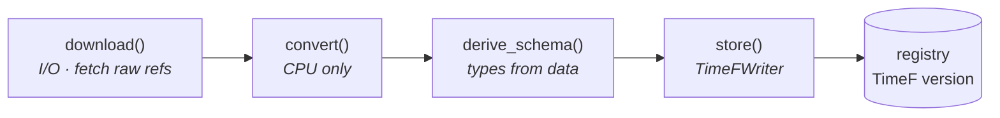

# Data model

TimeNet is a standardization layer. It registers, downloads, converts, and serves different
time-series datasets in one on-disk format ([TimeF](../timef-dataset.md)). Then it gives you the data.
TimeNet is not a training toolkit. These pages show the shape of that data:

- **[Datasets](datasets.md)**: versioned collections addressed by an `org/name` id.
- **[Records](records.md)**: one recording with its signals, annotations, and tasks.
- **[Time series](time-series.md)**: one signal's values over time. A record has one or more.
- **[Annotations](annotations.md)**: scoped side-information in three shapes.
- **[Tasks](tasks.md)**: the labeled training targets built from a record.

The code examples follow one running example: a machine's vibration and temperature signals. But the
same primitives describe any sensor stream, from an ECG to a market series.

## Ingesting a dataset

To add a dataset, write one [`BaseConnector`](../connectors.md). The engine drives it through a
fixed pipeline. `download` fetches raw files. `convert` parses them without network I/O. The engine
derives the schema and stores one TimeF version. The version contains a manifest, a DuckDB control
database, and Parquet or Zarr Signal values. Reading it never runs connector code.

