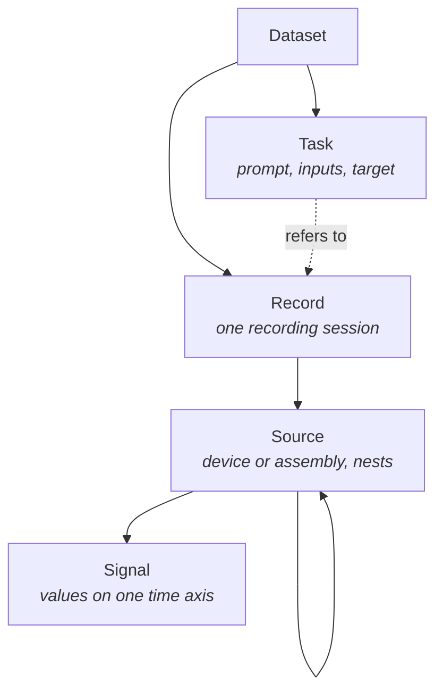

# Data model

TimeNet is a standardization layer. It serves different time-series datasets in one on-disk format
([TimeF](../timef-format.md)), and then gives you the data. It is not a training toolkit. These
pages show the shape of that data:

- **[Datasets](datasets.md)**: versioned collections addressed by an `org/name` id.
- **[Records](records.md)**: one recording session, and the source tree inside it.
- **[Signals](signals.md)**: one sequence of values on one time axis.
- **[Annotations](annotations.md)**: statements attached to any entity, in three time shapes.
- **[Tasks](tasks.md)**: a prompt, its inputs, and its target.

The code examples follow one running example: a machine's vibration and temperature signals. The
same primitives describe any sensor stream, from an ECG to a market series.

## The hierarchy

Four objects nest, and annotations attach to any of them.



A `Source` nests, so one record can describe a bedside monitor holding an ECG and a thermometer, or
an IMU holding an accelerometer, a gyroscope, and a magnetometer. A `Signal` is a leaf: one sequence
of values, one time axis, one spec.

## Building one

A builder assembles these objects and hands them to a [`TimeFWriter`](../timef-writer.md), which
compiles them into a version directory. The objects carry no storage detail. The writer derives the
surrogate ids, the attachment rows, and the chunk locators.

```python
from timenet.control_plane import (
    Annotation, DeclarativeDataset, Record, Signal, Source, Task, TimeFWriter,
)

vibration = Signal(id="run-1-vibration", name="vibration", values=values,
                   time_axis=axis, spec=vibration_spec)
machine = Source(id="run-1-machine", name="Machine", signals=[vibration])
record = Record(id="run-1", sources=[machine])
record.annotate(
    Annotation.static(name="operating_hours", value=1200, unit="hours")
)

dataset = DeclarativeDataset(metadata=metadata)
dataset.add_record(record)

with TimeFWriter(root, metadata) as writer:
    writer.write(dataset)
```

A record can be added on its own. An unlabelled pretraining corpus is records with no tasks, and it
needs no invented prompt to exist.
