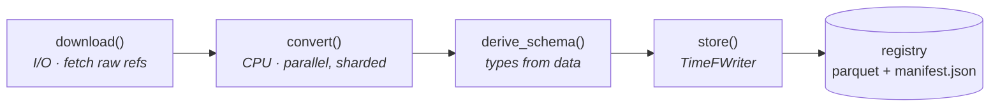

# Data model

TimeNet is a standardization layer. It registers, downloads, converts, and serves heterogeneous
time-series datasets in one on-disk format ([TimeF](../timef-dataset.md)), then hands you the data. It
is not a training toolkit. These pages walk the shape of that data:

- **[Datasets](datasets.md)** — versioned collections addressed by an `org/name` id.
- **[Samples](samples.md)** — one recording: its signals, plus annotations, tasks, and metadata.
- **[Time series](time-series.md)** — one channel's values over time; a sample has one or more.
- **[Annotations](annotations.md)** — scoped side-information, in three shapes.
- **[Tasks](tasks.md)** — the labeled training targets built from a sample.

The code examples follow one running example, a machine's vibration and temperature channels, but the
same primitives describe any sensor stream, from an ECG to a market series.

## Ingesting a dataset

Each dataset is onboarded by writing one [`BaseConnector`](../connectors.md). The engine drives it
through a fixed pipeline: `download` fetches raw files (I/O only), `convert` parses them into an
in-memory dataset (CPU only, and sharded across workers), the schema is derived from the data, and the
result is stored as parquet plus a `manifest.json`. The whole surface is frozen dataclasses, so datasets
round-trip deterministically and the consumer SDK never runs connector code.

