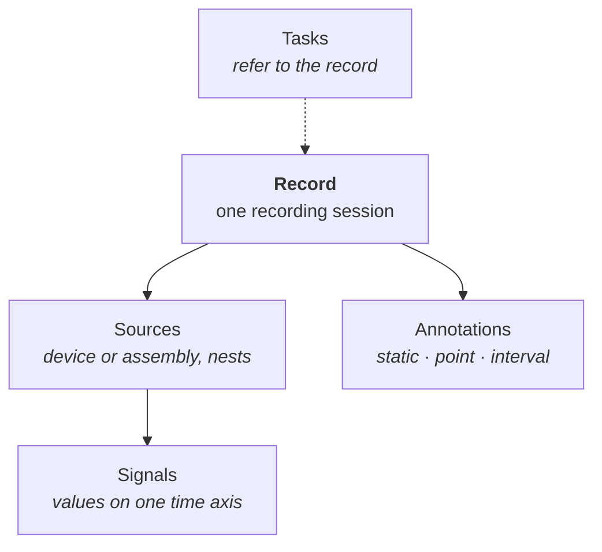

# Records

A record is one recording session: a single patient examination, one machine run, or one market
window. It holds a tree of sources, and each source holds child sources or signals.



- **Sources** are where the data came from: a bedside monitor, an IMU, a sensor rig. They nest, so
  the structure of the instrument survives into the dataset.
- **[Signals](signals.md)** are the leaves: one sequence of values on one time axis.
- **[Annotations](annotations.md)** are statements about the record, a source, or a signal.
- **[Tasks](tasks.md)** point at the record, not the other way round.

A record has no metadata slot. Record-level context, such as a subject's age, the device, or the
split, is an [annotation](annotations.md) with no span.

## The source tree

```python
from timenet.control_plane import Record, Source

imu = Source(
    id="run-1-imu",
    name="IMU",
    sources=[
        Source(id="run-1-accel", name="Accelerometer", signals=accel_axes),
        Source(id="run-1-gyro", name="Gyroscope", signals=gyro_axes),
    ],
)
record = Record(id="run-1", sources=[imu], start_time_us=1_700_000_000_000_000)
```

`record.walk_sources()` returns every source parents-first, and `record.signals()` returns every
signal in that walk order. The reader's `RecordView` offers the same two calls, so the shape a
builder wrote is the shape a consumer reads.

On disk, each source records its parent and a materialized `path` such as `0000.0001`. A subtree is
then a prefix match and depth-first order is `ORDER BY path`, so neither needs recursion.
`reader.subtree(record_id, source_id)` uses that.

## One signal, several records

A signal can belong to several sources, including sources in different records. Real corpora do this
constantly: several questions ask about the same underlying series. The link between a source and a
signal is a table row, so the values are stored once and referenced as often as needed.

## Start time

`start_time_us` is the only wall-clock field in the whole model: the moment the session started, in
Unix microseconds. Everything else is an offset from the record's relative zero. A recording with no
known date leaves it unset. That is a supported case, not missing data. See
[Signals](signals.md#time-offsets-and-timestamps).

## Ids

`Record(id=...)` is the id you choose, and it is stored as `external_id`. It survives a rebuild and
it is what `reader.record()` takes. The writer separately assigns a dense integer `record_id` that
every join runs on; that one follows the walk, so it is not stable across rebuilds and nothing
outside the file should quote it.
