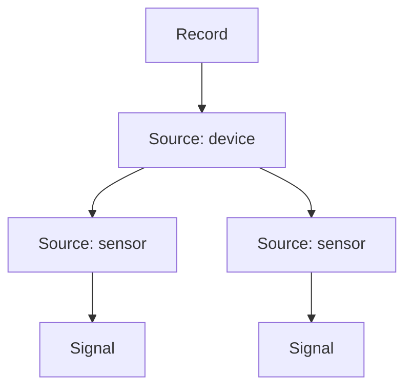

# Records

A `Record` is one observation unit. It can represent a patient visit, a machine run, or a market
window.

Each Record owns a hierarchy of Sources and Signals:


```mermaid
flowchart TB
    R["Record"]
    D["Source: device"]
    S1["Source: sensor"]
    S2["Source: sensor"]
    A["Signal"]
    B["Signal"]
    R --> D
    D --> S1
    D --> S2
    S1 --> A
    S2 --> B
```

A Source represents a device, sensor, or subsystem. It can contain child Sources and direct Signals.
A Signal is always a leaf.

## Create a Record

Build the hierarchy from the leaves upward:

```python
from timenet.dataset import Record, Source

accelerometer = Source(
    id="accelerometer",
    name="Accelerometer",
    signals=(acceleration_x, acceleration_y, acceleration_z),
)
imu = Source(
    id="imu",
    name="IMU",
    sources=(accelerometer,),
)
record = Record(
    record_id="run-001",
    sources=(imu,),
    metadata={"site": "lab-a"},
)
```

`record.signals` returns every Signal in deterministic hierarchy order. Use `walk_sources()` or
`walk_signals()` when you need an iterator.

Each Source and Signal has one owner. TimeNet rejects cycles, duplicate IDs, and objects attached in
more than one place.

## Store context

Use `metadata` for JSON-compatible details that do not need a typed schema. Examples include an
internal site code or source-specific import data.

Use an [Annotation](annotations.md) for a typed, searchable fact. Examples include age, condition,
firmware version, or an event on the timeline.

```python
from timenet.types import Annotation

record.annotate(Annotation(key="condition", value="healthy"))
```

Sources and Signals also support `metadata` and `annotate()`.

## Add time information

Each Record has one `TimeOrigin`. All Signal offsets and time annotations use this common
relative zero. The connector aligns the data before it constructs the Record.

```python
from datetime import datetime, timezone
from timenet.dataset import Record, Source
from timenet.types import TimeOrigin

origin = TimeOrigin(datetime(2026, 1, 1, tzinfo=timezone.utc))
record = Record(
    record_id="run-001",
    start_time=origin,
    sources=(
        Source(name="sensor A", signals=(signal_a,)),
        Source(name="sensor B", signals=(signal_b,)),
    ),
)
```

`record.start_time.timestamp` is whole Unix microseconds or `None`. A missing absolute timestamp
does not prevent relative alignment. The default is a fresh `TimeOrigin(None)` for each Record.

Related Records can explicitly share one origin, including an unknown origin. Separate unknown
origins do not imply alignment. A converter must not invent a date, timezone, or synchronization.

A regular axis stores a cadence and an offset from the Record origin. An irregular axis stores
each offset. An ordinal axis records order only, with no assumed elapsed time.

`time_span` can declare a session interval that contains all Signal windows. This field permits
events during gaps when every sensor is off.

## Connect tasks

A [Task](tasks.md) refers directly to its input Records. Registering a Task adds its ID to each input
Record.

```python
from timenet.types import ClassificationTask

task = ClassificationTask(
    inputs=(record,),
    targets=("healthy",),
)
dataset.add_task(task=task)
```

Use `dataset.tasks_for(record)` to resolve the Task objects for one Record.
