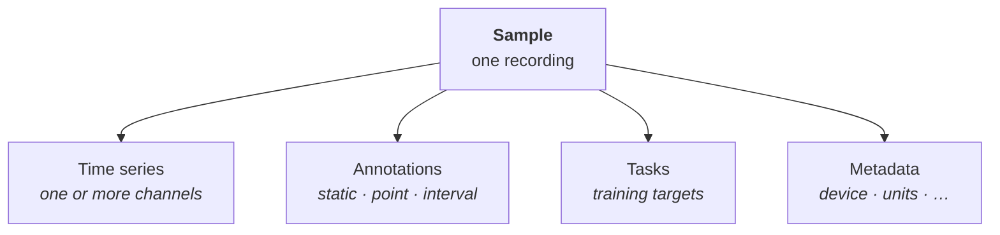

# Samples

A sample is one recording: a single patient trace, one machine run, one market window. It bundles four
things (click a box to jump to its page).

- **[Time series](time-series.md)** are the raw signal: a sample has one or more channels, such as the
  vibration and temperature channels of a machine.
- **[Annotations](annotations.md)** are scoped side-information: a label, an event, or a full reading.
- **[Tasks](tasks.md)** are the labeled training targets built from the sample.
- **Metadata** is sample-level context: subject, device, split, and so on.

## Modalities and units

Each modality is declared once through a typed [spec](../types.md): a name and the units of the
sampling-rate, timestamp, and value axes, with physical units enforced via [pint](https://pint.readthedocs.io).
Because the units are part of the type, an accelerometer trace in g, a temperature channel in °C, and a
market series in a currency all read through the same API, and the format rejects a unit of the wrong dimension
(a value axis that is not a physical quantity, a sampling rate that is not a frequency) before it reaches
storage.
