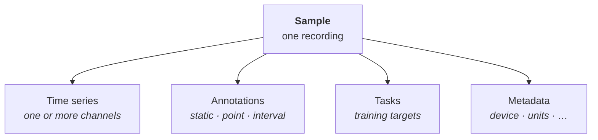

# Samples

A sample is one recording: a single patient trace, one machine run, or one market window. A sample
bundles four things. To open a page, click its box.

- **[Time series](time-series.md)** are the raw signal: a sample has one or more channels, such as the
  vibration and temperature channels of a machine.
- **[Annotations](annotations.md)** are scoped side-information: a label, an event, or a full reading.
- **[Tasks](tasks.md)** are the labeled training targets built from the sample.
- **Metadata** is sample-level context: subject, device, split, and so on.

## Modalities and units

A typed [spec](../types.md) declares each modality once: a name and the unit of its values. TimeF
carries the unit as a [pint](https://pint.readthedocs.io) unit. The unit is part of the type. So
different signals read through the same API. Examples are an accelerometer trace in g, a temperature
channel in °C, and a market series in a currency. The spec declares no unit for time. Time offsets are
whole microseconds by construction. So a caller cannot state another unit.
