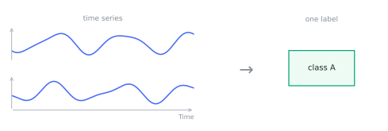
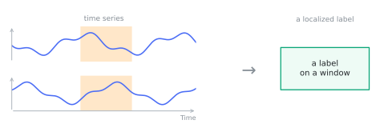
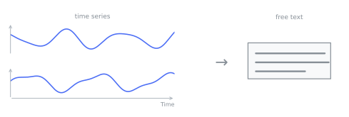
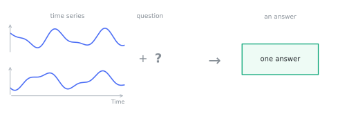
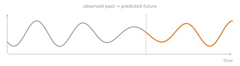
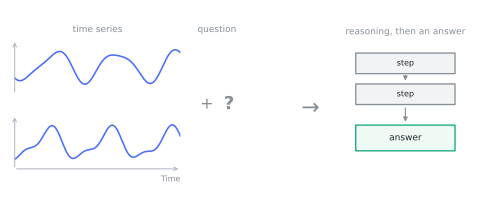
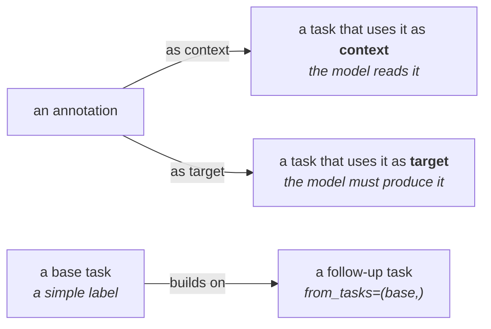

# Tasks

A task is a labeled training target that references one or more [samples](samples.md). The task **class
is the type tag** (usable as a search filter, for example `search(task=ClassificationTask)`) and the
**instance carries the payload**. Every task is framed the same way: a prompt over one or more samples
goes in, and depending on the task the model returns text, a series, or both.

There are six concrete task types.

## ClassificationTask

One discrete label applied to the whole sample. No free text out. `target_schema` names the vocabulary
the label belongs to.

```python
from timenet.types import ClassificationTask

ClassificationTask(target="faulty", target_schema="condition")
```

<figure markdown="span">
  
</figure>

## LabelingTask

Time-localized labels within a sample, optionally targeting specific series and windows. Where
`ClassificationTask` labels the whole recording, `LabelingTask` labels a region of it: pass
`time_series_ids` and `windows_s` (a tuple of `(start_s, end_s)` pairs), or leave them `None` for all
series over the full duration.

```python
from timenet.types import LabelingTask

LabelingTask(target="fault_episode", time_series_ids=("vibration",), windows_s=((5.0, 8.0),))
```

<figure markdown="span">
  
</figure>

## CaptioningTask

A free-text description of the recording: prompt in, a paragraph out. The `target` is the caption.

```python
from timenet.types import CaptioningTask

CaptioningTask(target="A 10-second vibration trace with rising amplitude and a periodic impact after 5 s.")
```

<figure markdown="span">
  
</figure>

## QATask

A question and answer pair: a single-label answer to a question about the sample.

```python
from timenet.types import QATask

QATask(question="Is the machine healthy?", target="No, a bearing fault is present")
```

<figure markdown="span">
  
</figure>

## ForecastingTask

Context samples predict a target sample: a future series out, no text. It references sample ids rather
than raw arrays, so both the context and the target stay traceable to their dataset versions.

```python
from timenet.types import ForecastingTask

ForecastingTask(context_sample_ids=("2024-01-01",), target_sample_id="2024-01-02")
```

<figure markdown="span">
  
</figure>

## ReasoningTask

A question answered by reasoning to a final answer. Unlike `QATask`, it carries the chain of thought in
`rationale`; the `target` is the evaluation target. Reasoning tasks are usually **composed** from a base
task via `from_tasks`, so a handful of base labels multiply into many higher-level training samples.

```python
from timenet.types import ClassificationTask, ReasoningTask

base = ClassificationTask(target="faulty", target_schema="condition")

ReasoningTask(
    question="Does this trace show a bearing fault? Walk through your reasoning.",
    rationale=(
        "The vibration amplitude grows steadily after 5 s and a sharp impact repeats once per shaft "
        "revolution. That periodicity matches the bearing's ball-pass frequency rather than imbalance, "
        "which would track shaft speed."
    ),
    target="Yes, an outer-race bearing fault",
    from_tasks=(base,),
)
```

<figure markdown="span">
  
</figure>

## Context or target

An annotation can be used two ways in a task:

- as **context**: something the model reads to help it answer, or
- as the **target**: the thing the model has to produce.

The same annotation can be the context for one task and the target of another.

Tasks can also build on each other. With `from_tasks`, one task feeds into another, so a simple label can
seed a harder task about the same sample. A few basic labels turn into many richer training examples.


