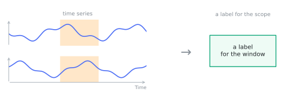
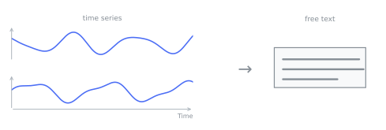
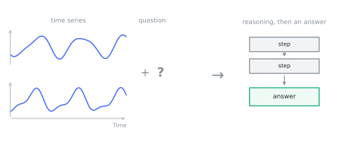
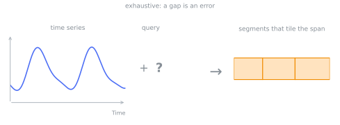
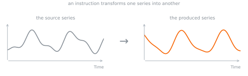
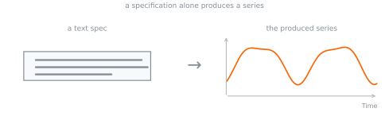
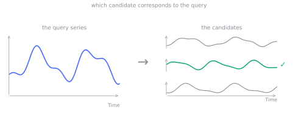
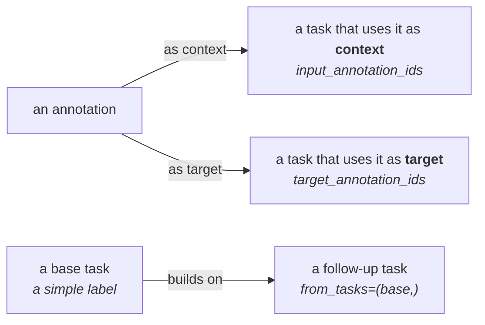

# Tasks

A task is a labeled training target that references one or more [samples](samples.md). The task **class
is the type tag** (usable as a search filter, for example `search(task=ClassificationTask)`) and the
**instance carries the payload**.

Every task is the same shape: *inputs -> one typed answer*. That shared frame lives on the base class, so
every task — whatever its type — can carry these:

| Field | What it is |
| --- | --- |
| `sample_ids` | The samples the task is about, populated by `add_task`. |
| `prompt` | What the model is asked. `None` for an unprompted task. |
| `scope` | A [`Span`](#the-span-primitive) narrowing the input to a region. `None` means the whole sample. |
| `input_annotation_ids` | Annotations handed to the model as context. |
| `target` | The answer, typed by the subclass. |
| `target_annotation_ids` | The answer *by reference*: stored annotations rather than an inline copy. |
| `rationale` | A chain of thought to train on. |
| `from_tasks` | Source tasks this one was derived from. |

Because prompt and scope are shared, a task type is defined by **what kind of thing its answer is** — a
category, free text, a number, a set of regions, or a produced series — and nothing else. There are eight
concrete types.

## The Span primitive

A `Span` is a point or a half-open interval `[start, end)`, optionally scoped to particular series, read in one of
two frames. In the default seconds frame its bounds are whole microseconds on the **source recording timeline**, the
same frame a series' `time_axis` places its values in, so a span stays meaningful on a windowed sample that starts
partway into the recording. In the steps frame they are step ordinals on the named series, which is the only way to
name a region of an ordinal series that has no timeline. Build a `PointSpan` and the span is a single position.

```python
from timenet.types import IntervalSpan, PointSpan

# an interval on one channel
IntervalSpan.seconds(5.0, 8.0, time_series_ids=("vibration",))

# a point, every channel
PointSpan.seconds(1.2)

# steps on an ordinal series, which has no seconds to name
IntervalSpan.steps(0, 12, time_series_ids=("passengers",))
```

One primitive covers both directions of time localization: a `scope` is a region **given** to the model,
and a `TemporalLocalizationTask` target is a region the model must **find**.

## ClassificationTask

One categorical label. With no `scope` it labels the whole sample; with one it labels that region. Those
are the same question asked of different amounts of input, so they are one type. `target_schema` names
the vocabulary the label belongs to.

```python
from timenet.types import ClassificationTask, IntervalSpan

ClassificationTask(target="faulty", target_schema="condition")

ClassificationTask(
    target="fault_episode",
    target_schema="condition",
    scope=IntervalSpan.seconds(5.0, 8.0, time_series_ids=("vibration",)),
)
```

<figure markdown="span">
  
</figure>

<figure markdown="span">
  
</figure>

## AnswerTask

Free-form text out. Unprompted, it is a caption; with a `prompt`, it is a question answered.

```python
from timenet.types import AnswerTask

AnswerTask(
    target=(
        "A 10-second vibration trace with rising amplitude and a periodic "
        "impact after 5 s."
    )
)

AnswerTask(
    prompt="Is the machine healthy?",
    target="No, a bearing fault is present",
)
```

<figure markdown="span">
  
</figure>

<figure markdown="span">
  
</figure>

Add a `rationale` and the same task supervises the reasoning as well as the answer. The field is on the
base, so this is not a separate type — **any** task can carry a chain of thought.

```python
from timenet.types import AnswerTask, ClassificationTask

base = ClassificationTask(target="faulty", target_schema="condition")

AnswerTask(
    prompt="Does this trace show a bearing fault? Walk through your reasoning.",
    rationale=(
        "The vibration amplitude grows steadily after 5 s and a sharp "
        "impact repeats once per shaft revolution. That periodicity matches "
        "the bearing's ball-pass frequency rather than imbalance, which "
        "would track shaft speed."
    ),
    target="Yes, an outer-race bearing fault",
    from_tasks=(base,),
)
```

<figure markdown="span">
  
</figure>

## ScalarPredictionTask

One number out, keeping the quantity and its physical unit as data. A regression target encoded as a
string in an answer task loses its type; keeping it a `float` with a `unit` makes regression metrics,
batching, and unit-aware conversion straightforward.

```python
from timenet.types import IntervalSpan, ScalarPredictionTask

ScalarPredictionTask(
    target=62.0,
    unit="bpm",
    target_name="mean_heart_rate",
    scope=IntervalSpan.seconds(0.0, 30.0),
)
```

<figure markdown="span">
  
</figure>

## TemporalLocalizationTask

Regions out: find where something happens, given a description of it. The inverse of a scoped
`ClassificationTask`, which supplies the region and asks for its label. One type covers event detection,
segmentation, and change-point detection, because they share this target: a tuple of `Span`s.

`mode` says whether unmarked time is allowed. `SPARSE` means only the marked spans are claimed (R-peaks);
`EXHAUSTIVE` means the spans are expected to tile the region of interest and a gap is an error (sleep
staging).

```python
from timenet.types import LocalizationMode, PointSpan, TemporalLocalizationTask

TemporalLocalizationTask(
    prompt="Locate all R-peaks in lead II.",
    mode=LocalizationMode.SPARSE,
    target=(
        PointSpan.seconds(1.20, time_series_ids=("II",)),
        PointSpan.seconds(2.05, time_series_ids=("II",)),
    ),
)

TemporalLocalizationTask(
    prompt="Segment the night into sleep stages.",
    mode=LocalizationMode.EXHAUSTIVE,
    # the answer is the stored annotations
    target_annotation_ids=("ann-n2-0007", "ann-n3-0008"),
)
```

<figure markdown="span">
  
</figure>

<figure markdown="span">
  
</figure>

## ForecastingTask

Continue the context into the future. The future is either a whole separate sample
(`target_sample_id`) or a region of the sample the task is attached to (`target_span`): exactly one,
never both and never neither. The sample-id form references ids rather than raw arrays, so context and
horizon stay traceable to their dataset versions.

```python
from timenet.types import ForecastingTask

ForecastingTask(
    context_sample_ids=("2024-01-01",), target_sample_id="2024-01-02"
)
```

`target_span` lets a single unsplit series carry a horizon, so a dataset can ship the raw recording
rather than a context/target pair. It is the region to predict on the source recording timeline, must
be an interval (a point has no duration, so it names no values), and needs an explicit `scope` for the
context — the default `scope=None` means the whole sample, which would include the region to predict.

```python
from timenet.types import ForecastingTask, IntervalSpan

# forecast the last 12 s of a 144 s recording, given the first 132 s as context
ForecastingTask(
    scope=IntervalSpan.seconds(0.0, 132.0),
    target_span=IntervalSpan.seconds(132.0, 144.0),
)
```

<figure markdown="span">
  
</figure>

## TSEditingTask

A series out: transform the source sample into the target sample, as the `prompt` instructs. Covers
denoising, filtering, and deliberate corruption; both sides of the edit are stored samples.

```python
from timenet.types import TSEditingTask

TSEditingTask(
    prompt="Remove the baseline wander.",
    source_sample_id="ecg-raw",
    target_sample_id="ecg-clean",
)
```

<figure markdown="span">
  
</figure>

## TSGenerationTask

A series out from a text specification alone.

```python
from timenet.types import TSGenerationTask

TSGenerationTask(
    prompt="Generate a 150 bpm sinus-tachycardia ECG, 10 s at 500 Hz.",
    target_sample_id="ecg-synth-0001",
)
```

<figure markdown="span">
  
</figure>

## TSCorrespondenceTask

Relate one series to others. The task's `sample_ids` are the query, `candidate_sample_ids` is the pool the
answer is chosen from, and `target` names the correct one(s). Leave the pool empty to make it open-ended.

```python
from timenet.types import TSCorrespondenceTask

TSCorrespondenceTask(
    prompt="Which recording is most similar to this one?",
    candidate_sample_ids=("rec-a", "rec-b", "rec-c"),
    target=("rec-b",),
)
```

<figure markdown="span">
  
</figure>

## Context or target

An annotation can be used two ways in a task:

- as **context**: something the model reads to help it answer (`input_annotation_ids`), or
- as the **target**: the thing the model has to produce (`target_annotation_ids`).

The same annotation can be the context for one task and the target of another. A task gives its answer
either inline in `target` **or** by reference in `target_annotation_ids` — never both, and `add_task`
rejects a task that does. Pointing at stored annotations avoids duplicating, say, a night of sleep-stage
intervals into a task row.

Tasks can also build on each other. With `from_tasks`, one task feeds into another, so a simple label can
seed a harder task about the same sample. A few basic labels turn into many richer training examples.


