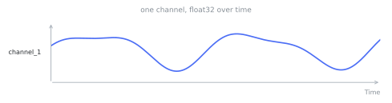

# Time series

A time series is one channel of a [sample](samples.md): `float32` values over time. A sample carries one
or more time series. Each one has a `time_series_id` (for example, the vibration and temperature channels
of a machine). The [`TimeSeriesSpec`](../types.md) gives the type and the units of the value, time, and
sampling-rate axes. A g-scale accelerometer channel and a °C temperature channel therefore read through
the same API.

<figure markdown="span">
  
</figure>

## Time offsets and timestamps

The docs and the API use two words for time, and they do not mean the same thing.

A **time offset** is a position on the series' own axis: microseconds from the sample's relative zero.
Every axis quantity is a time offset. The bounds of a [span](annotations.md) are also time offsets. A
time offset gives the position of a value inside its recording. It says nothing about the calendar day.

A **timestamp** is an absolute point on the wall clock, in Unix microseconds. Exactly one field carries a
timestamp: the `start_time` of a sample. The relative zero of the sample refers to this `start_time`.

The wall clock therefore enters a dataset one time, and it composes by addition:

```text
value timestamp = sample.start_time + value time offset
```

A recording with no known date has time offsets and no timestamps. This is a supported case, not missing
data. A 500 Hz ECG whose source gives no `base_date` sits exactly on its own axis. The question of which
calendar day it fell on has no answer. The format prefers no answer to a fabricated one.

## Reading values

Values load lazily through Apache Arrow. When you open a dataset, TimeNet does not pull every array into
memory. Read a channel with `to_numpy()` or `to_arrow()`:

```python
from timenet.client import TimeNet

dataset = TimeNet().load("chengsenwang/tsqa")
series = dataset.samples[0].time_series[0]
values = series.to_numpy()   # a float32 numpy array
```

## Sharing across samples

To share one channel across several samples, attach the same `TimeSeries` instance to each. You can also
attach two instances with the same explicit `time_series_id`. The [writer](../timef-writer.md) dedupes by
`time_series_id`. It stores the bytes one time, no matter how many samples reference them.
