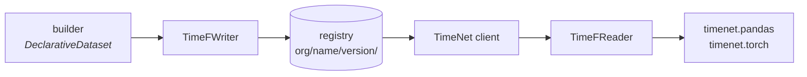

# TimeNet

TimeNet is a Python library. You use it to find, fetch, and read time-series datasets in a shared
format called TimeF. TimeF gives every dataset one on-disk shape and one way to load it. A consumer
reads ECGs, accelerometer traces, and market series through the same API.

!!! info "Scope"
    TimeNet is not a modeling toolkit. Training, inference, model definitions, and evaluation
    metrics are out of scope. TimeNet only gives you the data.

## How it fits together

A dataset version is one directory: a `manifest.json`, one embedded DuckDB database holding the
control plane, and the values plane beside it as Parquet shards or a Zarr store. A
[registry](registry.md) serves those directories. The [client](client.md) reads the manifest and
opens the version; [`TimeFReader`](timef-reader.md) answers questions about it in SQL and pulls
values through whichever backend wrote them.

- [`DeclarativeDataset`](timef-writer.md) is what a builder assembles: records, sources, signals,
  tasks, and annotations.
- [`TimeFWriter`](timef-writer.md) compiles that hierarchy into a version directory.
- [`TimeFReader`](timef-reader.md) reads a version back, a batch of records at a time.
- [`timenet.pandas` and `timenet.torch`](usage.md) turn those batches into frames or tensors.

## Where next

- [Get started](get-started.md): install TimeNet and read your first dataset.
- [Architecture](architecture.md): how the two planes, the registry, and the consumers fit together.
- [Data model](data-model/index.md): records, sources, signals, annotations, and tasks.
